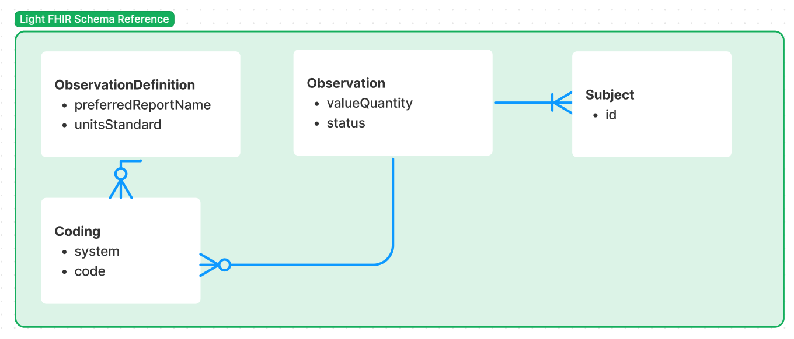

# Feature Request

As a User, I want to load a webpage containing a list of my most recent biomarker results containing the name of the biomarker, it's value and unit, and the timestamp associated.

As an engineer, I want to
* Retrieve data from the LIS service
* Persist the data in our EHR service
* Retrieve the data from our Server
* Display the data in our Frontend

# Existing Work

## Components

The `packages` directory contains two pre-created packages that act as a client/frontend and server.

A light implementation to connect and create necessary resources from the EHR system is provided.

### Frontend

A React Vite package is provided with [tailwindcss](https://tailwindcss.com/), [shadcn/ui](https://ui.shadcn.com/), and [react-query](https://tanstack.com/query/latest/docs/framework/react/overview) pre-installed at `packages/server`.

You can run the frontend using the following command:

```
make dev/frontend
```

### Server

A Node/Express package is provided with node-cron, a Medplum pre-authenticated client, and FHIR types pre-installed at `packages/server`.

Also provided are some helper functions to create and retrieve Observations and ObservationDefinitions from the EHR service.

You can run the server using the following command:

```
make dev/server
```

## FHIR Data Model



### ObservationDefinition

An [ObservationDefinition](https://build.fhir.org/observationdefinition.html) is a set of definitional characteristics for a kind of observation or measurement produced or consumed by an orderable health care service.

### Observation

An [Observation](https://hl7.org/fhir/observation.html) is a measurement or simple assertion made about a patient, device or other subject.

### CodeableConcept

A [CodeableConcept](https://build.fhir.org/datatypes.html#codeableconcept) represents a value that is usually supplied by providing a reference to one or more terminologies or ontologies but may also be defined by the provision of text. This is a common pattern in healthcare data.

# Dependencies

## Components

### LIS

A laboratory information system (LIS) is a healthcare software solution that processes, stores, and manages patient data related to laboratory processes and testing.

To emulate a LIS, we create an API at `localhost:3001` which returns demo laboratory results from the `/reports` endpoint.

### EHR

An electronic health record (EHR) is the systematized collection of patient and population electronically stored health information in a digital format.

To emulate an EHR, we run [Medplum](https://medplum.com). The EHR stores data in the [FHIR](https://hl7.org/fhir/) format and is used to store patient informatino.

The EHR is automatically seeded with the ObservationDefinitions needed to reference and save corresponding Observations.

## Building / Running

In order to build and start the dependencies necessary for this project, run the following commands:


```
make build/deps
make start/deps
```

In order to stop the dependencies, you can run the following:

```
make stop/deps
```

# System Dependencies

In order to ensure success with running the repository below, we encourage you to have pre-installed on your machine:

- Git
- Docker (& Compose)
- Node + Yarn + npm
- Editor - TypeScript

 and understanding of the following technologies:

- Express
- React (Vite)
- TailwindCSS & shadcn/ui
